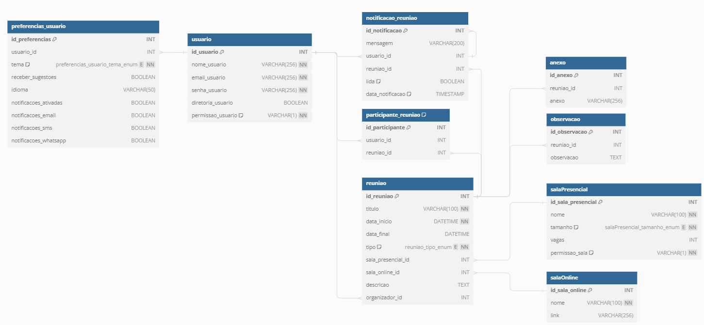

 Terceira Sprint - 26/05/2024
  ============================
  ****************************  
<h1>
 Euipe FULLSTACK - Projeto API 4º Semestre: 
 </h1>
<h1>
 FATEC São José dos Campos - Prof. Jessen Vidal 
</h1>

 #### 
 Estado do Projeto ao final da Terceira Sprint: 
1>
   
  

   
   
   
   
  

 
  
 
  

  #
  
   

<h1>
Nossa Equipe
</h1>

<table style="align: center">
      <thead>
        <th>Nome</th>
        <th>Foto</th>
        <th>Função</th>
        <th>Contato</th>
      </thead>
      <tbody>
        <tr>
          <td>Thiago Silva</td>
          <td></td>
          <td>Product Owner</td>
          <td>
            <a href="https://github.com/thiagosilva89">Github</a> 
            <a href="https://linkedin.com/in/thiago-c-silva-49bb74168">Linkedin</a>
          </td>
        </tr>
        <tr>
          <td>Juliano Prado</td>
          <td></td>
          <td>Scrum Master</td>
          <td>
            <a href="https://github.com/julianopradoo">Github</a> 
            <a href="https://linkedin.com/in/">Linkedin</a>
          </td>
        </tr>
        <tr>
          <td>Pedro Cardoso</td>
          <td></td>
          <td>Desenvolvedor</td>
          <td>
            <a href="https://phsc.rf.gd">Website</a> 
            <a href="https://github.com/PhscZ">Github</a> 
            <a href="https://linkedin.com/in/pedro-cardoso-6b93011b6/">Linkedin</a>
          </td>
        </tr>
        <tr>
          <td>Leonardo Gazola</td>
          <td></td>
          <td>Desenvolvedor</td>
          <td>
            <a href="https://github.com/Leonardo-Gazola-Medeiros">Github</a> 
            <a href="https://linkedin.com/in/leonardo-gazola/">Linkedin</a>
          </td>
        </tr>
         <tr>
          <td>Willians Motta</td>
          <td></td>
          <td>Desenvolvedor</td>
          <td>
            <a href="https://github.com/williansmott4">Github</a> 
            <a href="https://linkedin.com/in/">Linkedin</a>
          </td>
         </tr>
        <tr>
          <td>Giovani Avila</td>
          <td></td>
          <td>Desenvolvedor</td>
          <td>
            <a href="https://github.com/GiovaniAvila">Github</a> 
            <a href="https://www.linkedin.com/in/giovani-carvalho-avila-80593a224/">Linkedin</a>
          </td>
        </tr>
    </tbody>
</table>
 

  

<h1> Burndown
  
     
<h1> Backlog da Sprint </h1>
  
     
<h1> Diagrama Conceitual do Banco de Dados </h1>
  
     
<h1> Diagrama Logico do Banco de Dados </h1>
  
     

  
  
 

     
  
  
# 
SPRINTS

  ## <a href="https://github.com/Equipe-FULLSTACK/API-4/tree/SPRINT-1">Primeira Sprint</a>
  ##  
  ## <a href="https://github.com/Equipe-FULLSTACK/API-4/tree/SPRINT-2">Segunda Sprint</a>
  ##  
  ## <a href="https://github.com/Equipe-FULLSTACK/API-4/tree/SPRINT-3">Terceira Sprint</a>
  ##  
  ## <a href="https://github.com/Equipe-FULLSTACK/API-4/tree/SPRINT-4">Quarta Sprint</a>

  

  
